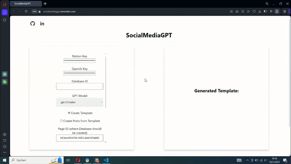

# SocialMediaGPT

[Try it out](https://socialmediagpt.onrender.com)

Never have a creative hole again.

Pick a viral post you saw, give it to `SocialMediaGPT`, generate a reusable template and let it create multiple new posts from it.

And it will insert them into a Notion database too.

## Demo

